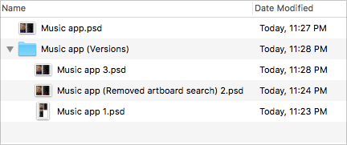

# Photoshop file versions script

Saves the `.psd` file twice. First, it saves the work file, just like you would using `File > Save` and then it saves another file next to that in adjacent folder "My file (Versions)".

## Options

You can find these variables at the top of the `Photoshop File Versions.jsx` file.

Both of these are either `true` or `false`.

* `notify` An optional alert that shows the name of the saved file on save. This helps make a mental note of which version is which.
* `shortDescription` An optional prompt for adding a small description in the filename. I would recommend 3-4 words max.

## How to use

You can just open the `.jsx` file in Photoshop to run it or alternative set a shortcut to run it, which is recommended.

**Set shortcut natively**

1. Put `Photoshop File Versions.jsx` in PS Scripts folder.
   - You can find it in the Photoshop install folder. For example (Mac): `/Applications/Adobe Photoshop CC 2019/Presets/Scripts`.
2. Restart Photoshop
3. Add the shortcut in `Edit > Keyboard shortcuts...` ( Mac: `Alt + Shift + Cmd + K`. Windows: `Alt + Shift + Ctrl + K` )
   * Choose `Shortcuts for: [Applications menus]`
   * Find `File > Scripts > Photoshop File Versions`
   * [Add a shortcut](readme_img/Shortcut.png) (something like `Cmd+Ctrl+S`), then press `Accept` and `Ok`.
     
> It is possible to set the script to run every time you save a document with the native shortcuts, but I would not recommend that because then you would obviously be saving extra versions every single time you save. It makes more sense to only save the new version when you feel you got something worth keeping.
     
**Set shortcut with party applications**

Third party applications are a great way to offer different ways to trigger scripts as well as sync scripts from computer to computer. Read more about that here: https://graphicdesign.stackexchange.com/a/63446/2332 - This post is about Illustrator but applies to Photoshop as well.

## Things you should know

* Version 1.5. tested in Photoshop CC 2019
   * Prior versions were tested in CS3 and CS6, but I can't say for certain it works in older versions anymore.
* A document needs to be open for the script to do anything.
* If you forget the shortcut you set in Photoshop, you can check it at `File > Scripts > Photoshop File Versions`
